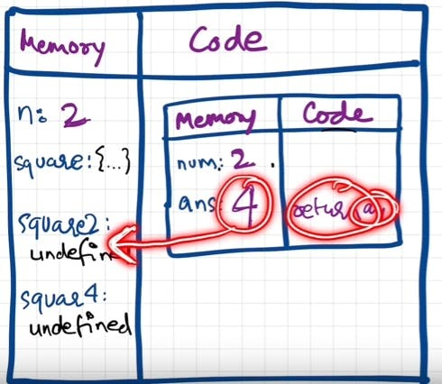

# Execution Context

- Everything in JS happens inside the execution context. Imagine a sealed-off container inside which JS runs.
  It is an abstract concept that hold info about the env. within the current code is being executed.
  

- In the container the first component is **memory component** and the 2nd one is **code component**

- Memory component has all the variables and functions in key value pairs. It is also called **Variable environment**.

- Code component is the place where code is executed one line at a time. It is also called the **Thread of Execution**.

- JS is a **synchronous**, **single-threaded** language
  - Synchronous:- In a specific synchronous order.
  - Single-threaded:- One command at a time.

# How JS is executed & Call Stack

- When a JS program is ran, a **global execution context** is created.

- The execution context is created in two phases.

  - Memory creation phase - JS will allocate memory to variables and functions.
  - Code execution phase

- Let's consider the below example and its code execution steps:

```js
var n = 2;
function square(num) {
  var ans = num * num;
  return ans;
}
var square2 = square(n);
var square4 = square(4);
```

The very **first** thing which JS does is **memory creation phase**, so it goes to line one of above code snippet, and **allocates a memory space** for variable **'n'** and then goes to line two, and **allocates a memory space** for **function 'square'**. When allocating memory **for n it stores 'undefined'**, a special value for 'n'. **For 'square', it stores the whole code of the function inside its memory space.** Then, as square2 and square4 are variables as well, it allocates memory and stores 'undefined' for them, and this is the end of first phase i.e. memory creation phase.

So O/P will look something like


Now, in **2nd phase** i.e. code execution phase, it starts going through the whole code line by line. As it encounters var n = 2, it assigns 2 to 'n'. Until now, the value of 'n' was undefined. For function, there is nothing to execute. As these lines were already dealt with in memory creation phase.

Coming to line 6 i.e. **var square2 = square(n)**, here **functions are a bit different than any other language. A new execution context is created altogether.** Again in this new execution context, in memory creation phase, we allocate memory to num and ans the two variables. And undefined is placed in them. Now, in code execution phase of this execution context, first 2 is assigned to num. Then var ans = num \* num will store 4 in ans. After that, return ans returns the control of program back to where this function was invoked from.



When **return** keyword is encountered, It returns the control to the called line and also **the function execution context is deleted**.
Same thing will be repeated for square4 and then after that is finished, the global execution context will be destroyed.
So the **final diagram** before deletion would look something like:


- Javascript manages code execution context creation and deletion with the the help of **Call Stack**.

- Call Stack is a mechanism to keep track of its place in script that calls multiple function.

- Call Stack maintains the order of execution of execution contexts. It is also known as Program Stack, Control Stack, Runtime stack, Machine Stack, Execution context stack.

# Hoisting in JavaScript (variables & functions)

- Let's observe the below code and it's explaination:

```js
getName(); // Namaste Javascript
console.log(x); // undefined
var x = 7;
function getName() {
  console.log("Namaste Javascript");
}
```

- It should have been an outright error in many other languages, as it is not possible to even access something which is not even created (defined) yet But in JS, We know that in memory creation phase it assigns undefined and puts the content of function to function's memory. And in execution, it then executes whatever is asked. Here, as execution goes line by line and not after compiling, it could only print undefined and nothing else. This phenomenon, is not an error. However, if we remove var x = 7; then it gives error. Uncaught ReferenceError: x is not defined

- **Hoisting** is a concept which enables us to extract values of variables and functions even before initialising/assigning value without getting error and this is happening due to the 1st phase (memory creation phase) of the Execution Context.

- So in previous lecture, we learnt that execution context gets created in two phase, so even before code execution, memory is created so in case of variable, it will be initialized as undefined while in case of function the whole function code is placed in the memory. Example:

```js
getName(); // Namaste JavaScript
console.log(x); // Uncaught Reference: x is not defined.
console.log(getName); // f getName(){ console.log("Namaste JavaScript); }
function getName() {
  console.log("Namaste JavaScript");
}
```

- Now let's observe a different example and try to understand the output.

```js
getName(); // Uncaught TypeError: getName is not a function
console.log(getName);
var getName = function () {
  console.log("Namaste JavaScript");
};
// The code won't execute as the first line itself throws an TypeError.
```

# let & const in JS, Temporal Dead Zone

- let and const declarations are hoisted. But its different from **var**
  ```js
  console.log(a); // ReferenceError: Cannot access 'a' before initialization
  console.log(b); // prints undefined as expected
  let a = 10;
  console.log(a); // 10
  var b = 15;
  console.log(window.a); // undefined
  console.log(window.b); // 15
  ```
  It looks like let isn't hoisted, **but it is**, let's understand
  - Both a and b are actually initialized as _undefined_ in hoisting stage. But var **b** is inside the storage space of GLOBAL, and **a** is in a separate memory object called script, where it can be accessed only after assigning some value to it first ie. one can access 'a' only if it is assigned. Thus, it throws error.

<br>

- **Temporal Dead Zone** : Time since when the let variable was hoisted until it is initialized some value.

  - So any line till before "let a = 10" is the TDZ for a
  - Since a is not accessible on global, its not accessible in _window/this_ also. window.b or this.b -> 15; But window.a or this.a ->undefined, just like window.x->undefined (x isn't declared anywhere)

- **Reference Error** are thrown when variables are in temporal dead zone.

- **Syntax Error** doesn't even let us run single line of code.

  - ```js
      let a = 10;
      let a = 100;  //this code is rejected upfront as SyntaxError. (duplicate declaration)
      ------------------
      let a = 10;
      var a = 100; // this code also rejected upfront as SyntaxError. (can't use same name in same scope)
    ```

- **Let** is a stricter version of **var**. Now, **const** is even more stricter than **let**.

  ```js
  let a;
  a = 10;
  console.log(a) // 10. Note declaration and assigning of a is in different lines.
  ------------------
  const b;
  b = 10;
  console.log(b); // SyntaxError: Missing initializer in const declaration. (This type of declaration won't work with const. const b = 10 only will work)
  ------------------
  const b = 100;
  b = 1000; //this gives us TypeError: Assignment to constant variable.
  ```

- Types of **Error**: Syntax, Reference, and Type.

  - Uncaught ReferenceError: x is not defined at ...

    - This Error signifies that x has never been in the scope of the program. This literally means that x was never defined/declared and is being tried to be accesed.

  - Uncaught ReferenceError: cannot access 'a' before initialization

    - This Error signifies that 'a' cannot be accessed because it is declared as 'let' and since it is not assigned a value, it is its Temporal Dead Zone. Thus, this error occurs.

  - Uncaught SyntaxError: Identifier 'a' has already been declared

    - This Error signifies that we are redeclaring a variable that is 'let' declared. No execution will take place.

  - Uncaught SyntaxError: Missing initializer in const declaration

    - This Error signifies that we haven't initialized or assigned value to a const declaration.

  - Uncaught TypeError: Assignment to constant variable
    - This Error signifies that we are reassigning to a const variable.

### SOME GOOD PRACTICES:

- Try using const wherever possible.
- If not, use let, Avoid var.
- Declare and initialize all variables with let to the top to avoid errors to shrink temporal dead zone window to zero.
