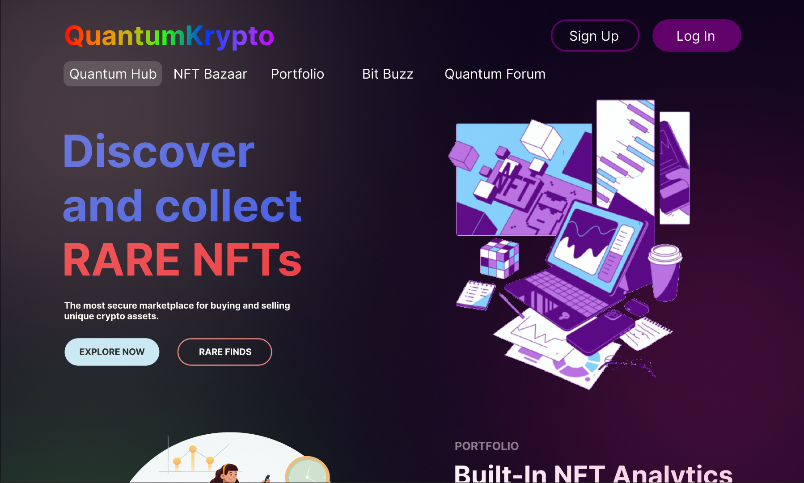
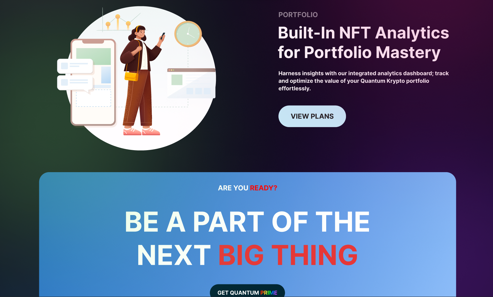
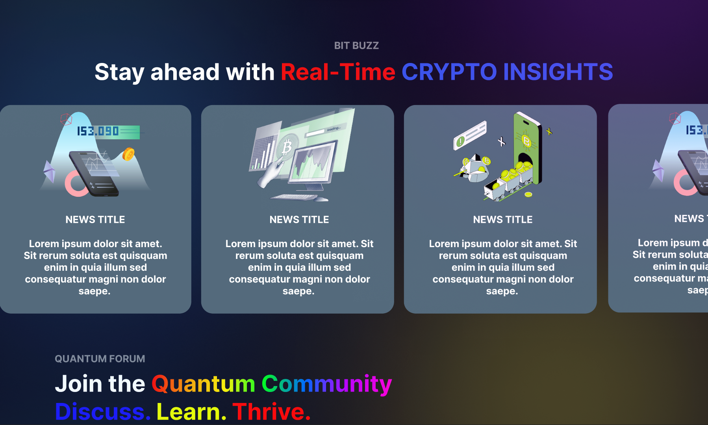
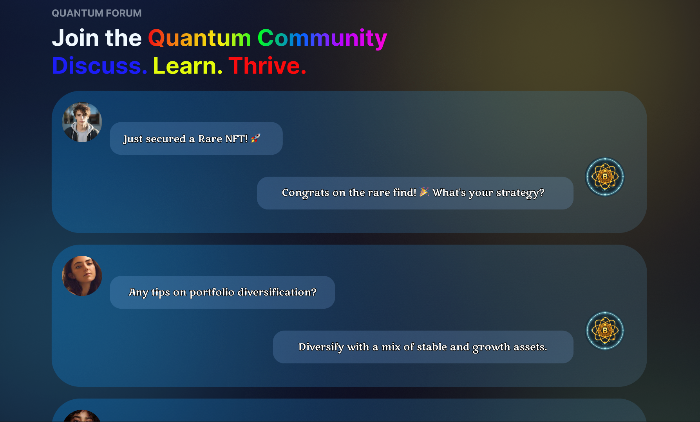
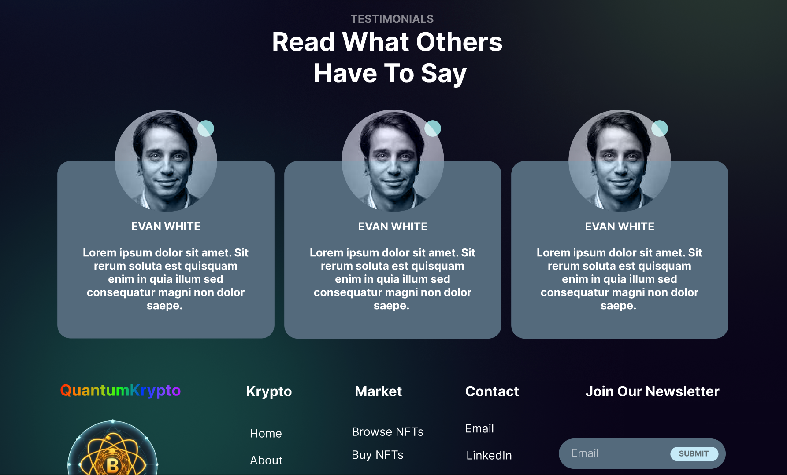
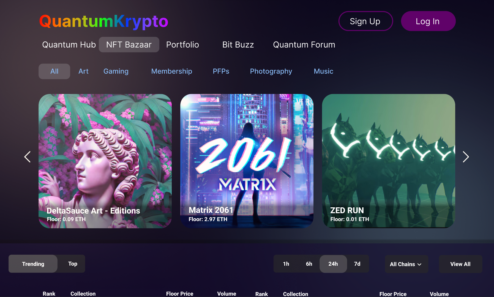
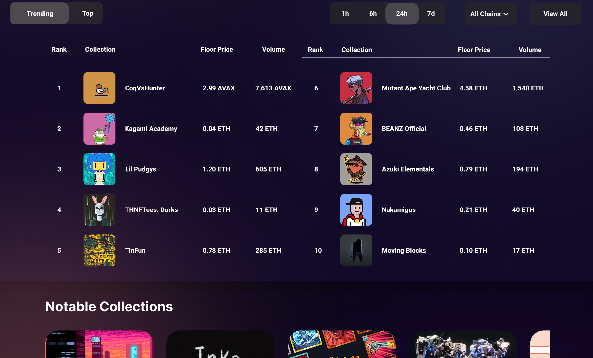
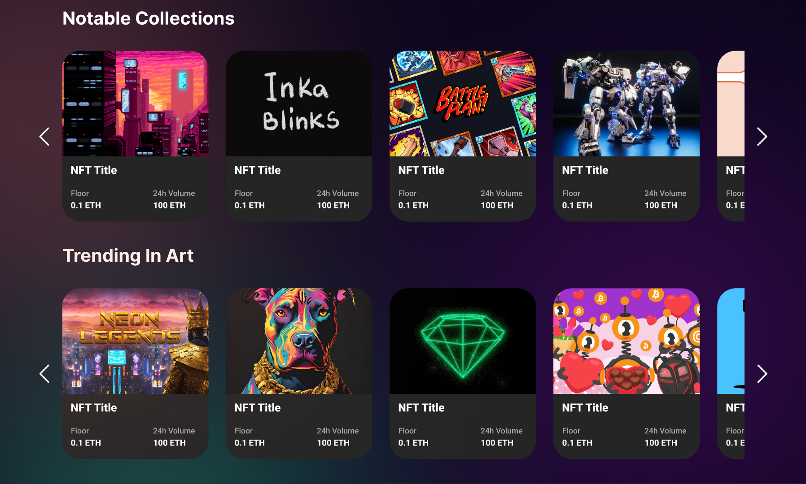
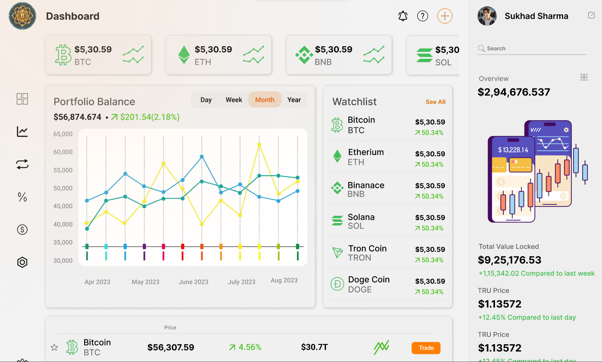

# Quantum Krypto Figma Design Report

## Project Overview

- **Project Name:** Quantum Krypto
- **Designer:** Sukhad Sharma
- **Date:** [Date of Design Completion]

## Introduction

Quantum Krypto is a tailored platform that seamlessly integrates NFT buying and selling, crypto portfolio management, and an information hub. This report details the design process and key components of the Quantum Krypto Figma project.

## Design Scope

The design focuses on user interfaces for NFT marketplace activities, portfolio management, and providing information about cryptocurrencies, excluding wallet and cryptocurrency exchange components.

## Design Process

The design process involved user research, wireframing, and the creation of high-fidelity designs to ensure a seamless and user-friendly experience.

### User Research

Conducted user research to understand user needs and preferences within the NFT and crypto portfolio space.

### Wireframes

Created wireframes to outline the basic structure and layout of key features, emphasizing simplicity for users new to the crypto space.

### High-Fidelity Designs

Translated wireframes into high-fidelity designs, incorporating design principles and patterns for a clean and approachable look.

## Design Components

Outlined below are some key design components used in the Quantum Krypto Figma design:

1. **NFT Marketplace Interface:**

   - User-friendly marketplace for buying and selling NFTs.
   - 

2. **Crypto Portfolio Management UI:**

   - Beginner-friendly portfolio tracking with real-time updates.
   - 

3. **Cryptocurrency Information Hub:**
   - User interface for accessing aggregated news and information.
   - 

## Design System

Utilized a cohesive design system to maintain consistency throughout the Quantum Krypto platform, focusing on simplicity and clarity.

## Interactive Prototypes

Explore interactive prototypes showcasing the user flow and interactions:

- [Quantum Hub Designs]

  

  

  

  

  

  

- [NFT Bazaar Designs]

  

  

  

  

- [Portfolio Designs]

  

  

## Challenges and Solutions

Overcame challenges in designing a platform for NFTs, portfolio management, and information delivery. Solutions included refining user interfaces for simplicity and accessibility.

## Feedback and Iterations

Incorporated feedback from stakeholders and usability testing, leading to iterative design improvements that prioritize ease of use.

## Conclusion

The Quantum Krypto Figma design aims to deliver a seamless and intuitive experience for users engaging in NFT transactions, portfolio management, and accessing cryptocurrency information.
